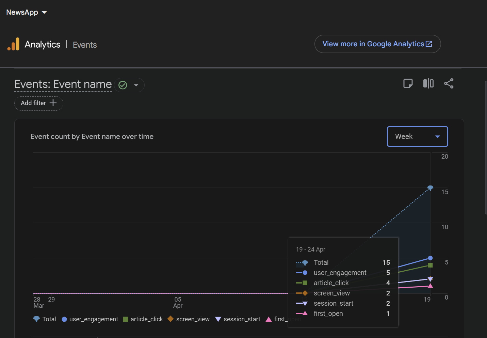

# NewsApp

A simple news app built as part of a take-home assignment. Uses NewsAPI to fetch and display the latest headlines, with search, pagination, and article bookmarking.

## Features

- Browse top headlines from NewsAPI
- Search articles by keyword
- Pull to refresh / manual refresh
- Tap any article to view details and open the full piece in your browser
- Save articles to a favorites list
- Smooth screen transition animations
- Dark mode support (follows system setting)

## Tech Stack

- Kotlin
- Jetpack Compose
- MVVM architecture
- Retrofit + Gson for API calls
- Kotlin Coroutines + Flow
- Paging 3 for paginated data loading
- DataStore for local favorites storage
- Firebase Analytics for interaction tracking
- Coil for image loading
- Compose Navigation with type-safe routes

## Project Structure
com.example.newsapp
├── components/         # ArticleCard, SearchBar
├── data/
│   ├── remote/         # Retrofit API service, paging source
│   ├── repository/     # NewsRepository
│   └── FavoritesManager.kt
├── model/              # Article, Source, NewsResponse
├── navigation/         # NavGraph with type-safe routes
├── ui/
│   ├── screens/        # MainScreen, DetailScreen, FavoritesScreen
│   ├── theme/          # Material3 theme
│   └── viewmodel/      # NewsViewModel
├── MainActivity.kt
└── NewsApplication.kt

## Setup

1. Clone the repo
2. Get a free API key from [newsapi.org](https://newsapi.org)
3. Add it to `app/build.gradle.kts`:
```kotlin
buildConfigField("String", "NEWS_API_KEY", "\"your_api_key_here\"")
```
4. Add your `google-services.json` from Firebase Console to the `app/` folder
5. Build and run

## Analytics

Tracked events via Firebase Analytics:

- `article_click` — when a user taps on a headline (includes title and source)
- `open_article` — when a user opens the full article in browser (includes url and source)
- `search_query` — when a user searches for a keyword



## Notes

- Search uses the `everything` endpoint which pulls from a broader article index — results may differ from top headlines since they come from different data sources
- The app defaults to US top headlines on the main screen
- Favorites are stored locally and persist across sessions